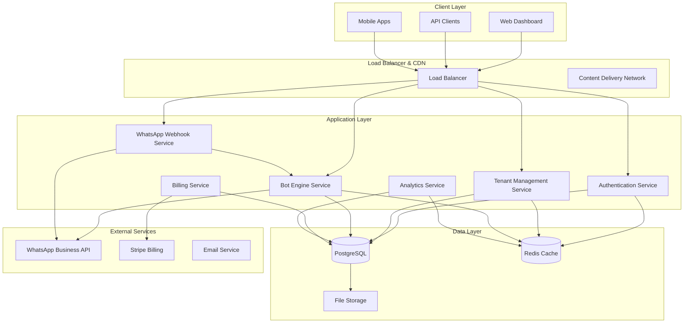

# Multi-Tenant SaaS Platform Design Document

## Overview

This design document outlines the architecture for transforming the existing WhatsApp booking bot POC into a production-ready, multi-tenant SaaS platform. The system will support unlimited business tenants with complete data isolation, automated onboarding, and dynamic bot configuration while maintaining high performance and security standards.

## Architecture

### High-Level Architecture



### Multi-Tenant Data Architecture

The system implements a **shared database, shared schema** approach with tenant isolation through `tenant_id` filtering:

#### Tenant Isolation Strategy
- **Row-Level Security (RLS)**: PostgreSQL RLS policies enforce tenant_id filtering at the database level
- **Application-Level Filtering**: All queries automatically include tenant_id in WHERE clauses
- **Middleware Enforcement**: Tenant context middleware ensures no cross-tenant data access
- **API Key Scoping**: API keys are scoped to specific tenants with embedded tenant_id

#### Database Schema Evolution
All existing tables will be modified to include `tenant_id`:

```sql
-- Example: Enhanced services table with tenant isolation
CREATE TABLE services (
    id VARCHAR PRIMARY KEY DEFAULT gen_random_uuid(),
    tenant_id VARCHAR NOT NULL REFERENCES tenants(id) ON DELETE CASCADE,
    name TEXT NOT NULL,
    description TEXT,
    price INTEGER NOT NULL,
    is_active BOOLEAN NOT NULL DEFAULT true,
    icon TEXT,
    created_at TIMESTAMP NOT NULL DEFAULT NOW(),
    updated_at TIMESTAMP NOT NULL DEFAULT NOW()
);

-- Row-Level Security Policy
ALTER TABLE services ENABLE ROW LEVEL SECURITY;
CREATE POLICY tenant_isolation_policy ON services
    FOR ALL TO authenticated_users
    USING (tenant_id = current_setting('app.current_tenant_id'));
```

## Components and Interfaces

### 1. Tenant Management Service

**Responsibilities:**
- Tenant registration and onboarding
- Subscription management
- Tenant configuration and settings
- WhatsApp Business API credential management

**Key Interfaces:**
```typescript
interface TenantService {
  createTenant(data: CreateTenantRequest): Promise<Tenant>
  updateTenantSettings(tenantId: string, settings: TenantSettings): Promise<void>
  validateWhatsAppCredentials(tenantId: string, credentials: WhatsAppCredentials): Promise<boolean>
  getTenantByDomain(domain: string): Promise<Tenant>
  suspendTenant(tenantId: string, reason: string): Promise<void>
}

interface Tenant {
  id: string
  businessName: string
  domain: string
  subscriptionPlan: SubscriptionPlan
  whatsappConfig: WhatsAppConfig
  botSettings: BotSettings
  status: 'active' | 'suspended' | 'trial'
  createdAt: Date
  updatedAt: Date
}
```

### 2. Authentication & Authorization Service

**Responsibilities:**
- Multi-factor authentication
- Role-based access control (RBAC)
- API key management
- Session management with tenant context

**Key Interfaces:**
```typescript
interface AuthService {
  authenticateUser(credentials: LoginCredentials): Promise<AuthResult>
  generateApiKey(tenantId: string, permissions: Permission[]): Promise<ApiKey>
  validateApiKey(key: string): Promise<TenantContext>
  refreshToken(refreshToken: string): Promise<AuthTokens>
}

interface TenantContext {
  tenantId: string
  userId: string
  permissions: Permission[]
  subscriptionLimits: SubscriptionLimits
}
```

### 3. Bot Engine Service

**Responsibilities:**
- Tenant-specific conversation flow management
- Dynamic bot configuration
- Message processing and routing
- Integration with WhatsApp Business API

**Key Interfaces:**
```typescript
interface BotEngine {
  processMessage(tenantId: string, message: WhatsAppMessage): Promise<BotResponse>
  updateBotConfiguration(tenantId: string, config: BotConfiguration): Promise<void>
  sendMessage(tenantId: string, to: string, message: string): Promise<boolean>
  getConversationState(tenantId: string, phoneNumber: string): Promise<ConversationState>
}

interface BotConfiguration {
  greetingMessage: string
  businessHours: BusinessHours
  services: Service[]
  paymentMethods: PaymentMethod[]
  customResponses: CustomResponse[]
  conversationFlow: ConversationFlow
}
```

### 4. WhatsApp Webhook Service

**Responsibilities:**
- Webhook verification and routing
- Message parsing and validation
- Tenant identification from phone numbers
- Rate limiting and abuse prevention

**Key Interfaces:**
```typescript
interface WebhookService {
  verifyWebhook(token: string, challenge: string): Promise<string>
  routeMessage(webhookData: WhatsAppWebhookData): Promise<void>
  identifyTenant(phoneNumberId: string): Promise<string>
  validateMessageFormat(message: any): Promise<WhatsAppMessage>
}
```

### 5. Billing Service

**Responsibilities:**
- Subscription management
- Usage tracking and metering
- Invoice generation
- Payment processing integration

**Key Interfaces:**
```typescript
interface BillingService {
  createSubscription(tenantId: string, plan: SubscriptionPlan): Promise<Subscription>
  trackUsage(tenantId: string, metric: UsageMetric, quantity: number): Promise<void>
  generateInvoice(tenantId: string, period: BillingPeriod): Promise<Invoice>
  processPayment(subscriptionId: string): Promise<PaymentResult>
  checkUsageLimits(tenantId: string): Promise<UsageLimitStatus>
}
```

## Data Models

### Core Tenant Tables

```sql
-- Tenants table (master tenant registry)
CREATE TABLE tenants (
    id VARCHAR PRIMARY KEY DEFAULT gen_random_uuid(),
    business_name VARCHAR(255) NOT NULL,
    domain VARCHAR(100) UNIQUE NOT NULL,
    email VARCHAR(255) NOT NULL,
    phone VARCHAR(50),
    status VARCHAR(20) NOT NULL DEFAULT 'trial',
    subscription_plan VARCHAR(50) NOT NULL DEFAULT 'starter',
    whatsapp_phone_id VARCHAR(100),
    whatsapp_token TEXT,
    whatsapp_verify_token VARCHAR(100),
    bot_settings JSONB DEFAULT '{}',
    billing_settings JSONB DEFAULT '{}',
    created_at TIMESTAMP NOT NULL DEFAULT NOW(),
    updated_at TIMESTAMP NOT NULL DEFAULT NOW()
);

-- Users table (tenant users and admins)
CREATE TABLE users (
    id VARCHAR PRIMARY KEY DEFAULT gen_random_uuid(),
    tenant_id VARCHAR NOT NULL REFERENCES tenants(id) ON DELETE CASCADE,
    email VARCHAR(255) NOT NULL,
    password_hash VARCHAR(255) NOT NULL,
    role VARCHAR(50) NOT NULL DEFAULT 'admin',
    first_name VARCHAR(100),
    last_name VARCHAR(100),
    is_active BOOLEAN NOT NULL DEFAULT true,
    last_login TIMESTAMP,
    created_at TIMESTAMP NOT NULL DEFAULT NOW(),
    updated_at TIMESTAMP NOT NULL DEFAULT NOW(),
    UNIQUE(tenant_id, email)
);

-- API Keys table
CREATE TABLE api_keys (
    id VARCHAR PRIMARY KEY DEFAULT gen_random_uuid(),
    tenant_id VARCHAR NOT NULL REFERENCES tenants(id) ON DELETE CASCADE,
    key_hash VARCHAR(255) NOT NULL UNIQUE,
    name VARCHAR(100) NOT NULL,
    permissions JSONB NOT NULL DEFAULT '[]',
    last_used TIMESTAMP,
    expires_at TIMESTAMP,
    is_active BOOLEAN NOT NULL DEFAULT true,
    created_at TIMESTAMP NOT NULL DEFAULT NOW()
);
```

### Enhanced Business Tables

```sql
-- Enhanced services table with tenant isolation
CREATE TABLE services (
    id VARCHAR PRIMARY KEY DEFAULT gen_random_uuid(),
    tenant_id VARCHAR NOT NULL REFERENCES tenants(id) ON DELETE CASCADE,
    name TEXT NOT NULL,
    description TEXT,
    price INTEGER NOT NULL,
    duration_minutes INTEGER DEFAULT 60,
    is_active BOOLEAN NOT NULL DEFAULT true,
    icon TEXT,
    category VARCHAR(100),
    metadata JSONB DEFAULT '{}',
    created_at TIMESTAMP NOT NULL DEFAULT NOW(),
    updated_at TIMESTAMP NOT NULL DEFAULT NOW()
);

-- Enhanced conversations table
CREATE TABLE conversations (
    id VARCHAR PRIMARY KEY DEFAULT gen_random_uuid(),
    tenant_id VARCHAR NOT NULL REFERENCES tenants(id) ON DELETE CASCADE,
    phone_number TEXT NOT NULL,
    customer_name TEXT,
    current_state TEXT NOT NULL DEFAULT 'greeting',
    selected_service VARCHAR REFERENCES services(id),
    selected_date TEXT,
    selected_time TEXT,
    context_data JSONB DEFAULT '{}',
    created_at TIMESTAMP NOT NULL DEFAULT NOW(),
    updated_at TIMESTAMP NOT NULL DEFAULT NOW(),
    UNIQUE(tenant_id, phone_number)
);

-- Enhanced messages table
CREATE TABLE messages (
    id VARCHAR PRIMARY KEY DEFAULT gen_random_uuid(),
    tenant_id VARCHAR NOT NULL REFERENCES tenants(id) ON DELETE CASCADE,
    conversation_id VARCHAR NOT NULL REFERENCES conversations(id) ON DELETE CASCADE,
    content TEXT NOT NULL,
    message_type VARCHAR(50) NOT NULL DEFAULT 'text',
    is_from_bot BOOLEAN NOT NULL,
    metadata JSONB DEFAULT '{}',
    timestamp TIMESTAMP NOT NULL DEFAULT NOW()
);

-- Enhanced bookings table
CREATE TABLE bookings (
    id VARCHAR PRIMARY KEY DEFAULT gen_random_uuid(),
    tenant_id VARCHAR NOT NULL REFERENCES tenants(id) ON DELETE CASCADE,
    conversation_id VARCHAR NOT NULL REFERENCES conversations(id),
    service_id VARCHAR NOT NULL REFERENCES services(id),
    phone_number TEXT NOT NULL,
    customer_name TEXT,
    customer_email TEXT,
    amount INTEGER NOT NULL,
    status VARCHAR(20) NOT NULL DEFAULT 'pending',
    payment_method VARCHAR(50),
    payment_reference TEXT,
    appointment_date TIMESTAMP,
    appointment_time TEXT,
    notes TEXT,
    metadata JSONB DEFAULT '{}',
    created_at TIMESTAMP NOT NULL DEFAULT NOW(),
    updated_at TIMESTAMP NOT NULL DEFAULT NOW()
);
```

### Subscription and Billing Tables

```sql
-- Subscription plans
CREATE TABLE subscription_plans (
    id VARCHAR PRIMARY KEY,
    name VARCHAR(100) NOT NULL,
    description TEXT,
    price_monthly INTEGER NOT NULL,
    price_yearly INTEGER,
    features JSONB NOT NULL DEFAULT '{}',
    limits JSONB NOT NULL DEFAULT '{}',
    is_active BOOLEAN NOT NULL DEFAULT true,
    created_at TIMESTAMP NOT NULL DEFAULT NOW()
);

-- Tenant subscriptions
CREATE TABLE subscriptions (
    id VARCHAR PRIMARY KEY DEFAULT gen_random_uuid(),
    tenant_id VARCHAR NOT NULL REFERENCES tenants(id) ON DELETE CASCADE,
    plan_id VARCHAR NOT NULL REFERENCES subscription_plans(id),
    status VARCHAR(20) NOT NULL DEFAULT 'active',
    billing_cycle VARCHAR(20) NOT NULL DEFAULT 'monthly',
    current_period_start TIMESTAMP NOT NULL,
    current_period_end TIMESTAMP NOT NULL,
    stripe_subscription_id VARCHAR(100),
    created_at TIMESTAMP NOT NULL DEFAULT NOW(),
    updated_at TIMESTAMP NOT NULL DEFAULT NOW()
);

-- Usage tracking
CREATE TABLE usage_metrics (
    id VARCHAR PRIMARY KEY DEFAULT gen_random_uuid(),
    tenant_id VARCHAR NOT NULL REFERENCES tenants(id) ON DELETE CASCADE,
    metric_name VARCHAR(100) NOT NULL,
    metric_value INTEGER NOT NULL DEFAULT 0,
    period_start TIMESTAMP NOT NULL,
    period_end TIMESTAMP NOT NULL,
    created_at TIMESTAMP NOT NULL DEFAULT NOW(),
    UNIQUE(tenant_id, metric_name, period_start)
);
```

## Error Handling

### Tenant Isolation Errors
- **Cross-tenant access attempts**: Log security events and return 403 Forbidden
- **Invalid tenant context**: Return 401 Unauthorized with tenant validation error
- **Tenant suspension**: Return 423 Locked with suspension details

### WhatsApp Integration Errors
- **Invalid credentials**: Notify tenant admin and provide credential update flow
- **Rate limiting**: Implement exponential backoff and queue management
- **Webhook failures**: Retry with circuit breaker pattern and dead letter queue

### Subscription and Billing Errors
- **Usage limit exceeded**: Soft limits with upgrade prompts, hard limits with service suspension
- **Payment failures**: Grace period with email notifications and retry logic
- **Plan changes**: Immediate upgrade, prorated billing for downgrades

## Testing Strategy

### Unit Testing
- **Tenant isolation**: Verify all database queries include tenant_id filtering
- **Authentication**: Test JWT token validation and API key scoping
- **Bot logic**: Test conversation flows with tenant-specific configurations
- **Billing**: Test usage tracking and limit enforcement

### Integration Testing
- **WhatsApp webhook routing**: Test message routing to correct tenants
- **Cross-service communication**: Test service-to-service authentication
- **Database transactions**: Test multi-tenant data consistency
- **External API integration**: Test WhatsApp and Stripe API interactions

### End-to-End Testing
- **Tenant onboarding**: Complete signup to first booking flow
- **Multi-tenant scenarios**: Concurrent operations across different tenants
- **Subscription lifecycle**: Trial to paid conversion and cancellation flows
- **Security testing**: Penetration testing for tenant isolation

### Performance Testing
- **Load testing**: 1000+ concurrent tenants with realistic message volumes
- **Database performance**: Query optimization with tenant_id indexing
- **Memory usage**: Monitor for tenant data leakage in application memory
- **API response times**: Sub-100ms for tenant operations, sub-2s for WhatsApp processing

### Security Testing
- **Tenant isolation**: Attempt cross-tenant data access through various attack vectors
- **Authentication bypass**: Test for privilege escalation and token manipulation
- **SQL injection**: Test all tenant-scoped queries for injection vulnerabilities
- **API security**: Test rate limiting, input validation, and authorization controls